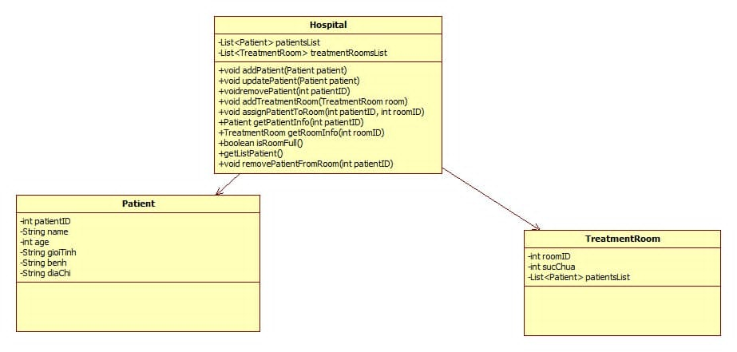

GROUP_10-OOP-N03 
# Hệ Thống Quản Lý Bệnh Viện

## Giới Thiệu Dự Án
Dự án này là một hệ thống quản lý bệnh viện, giúp tối ưu hóa và cải thiện hiệu quả hoạt động của các bệnh viện. Hệ thống cho phép quản lý hồ sơ bệnh nhân.
## Thành Viên Nhóm
- **Hoàng Lê Đức Huy**: Phát triển phần mềm toàn diện.
- **Nguyễn Hà Nguyên**: Phát triển phần mềm toàn diện.

## Chức Năng Chính
- Quản lý hồ sơ bệnh nhân.
- Lên lịch hẹn khám.
- Phân chia và quản lý phòng điều trị.
- Báo cáo và thống kê dữ liệu y tế.

## UML Dự Án



## Cách Cài Đặt
1. Clone repository từ GitHub:
   ```bash
   git clone https://github.com/Nguyen1976/JAVA_OOP_PKA_Nhom_10/tree/FinaltermCode
   