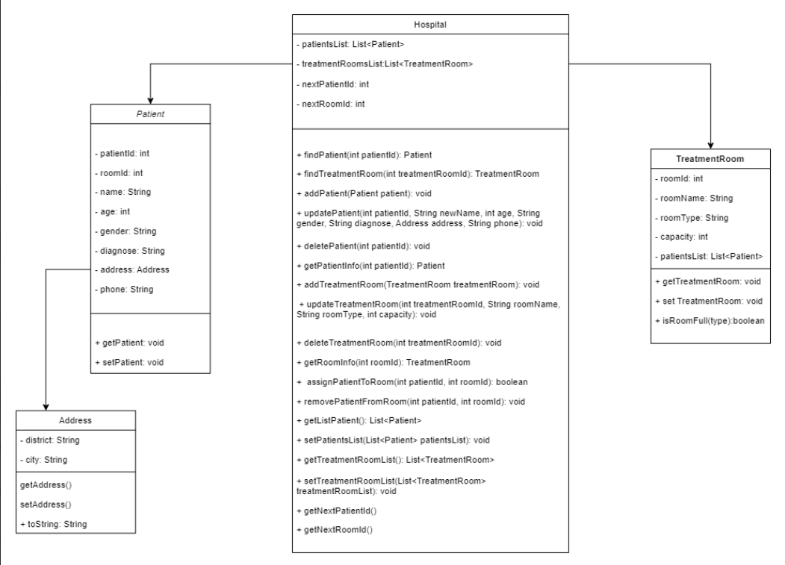
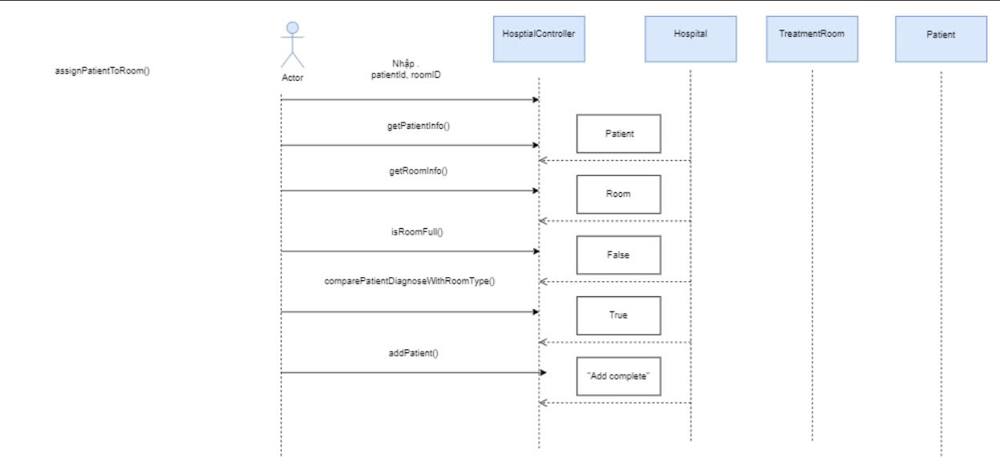
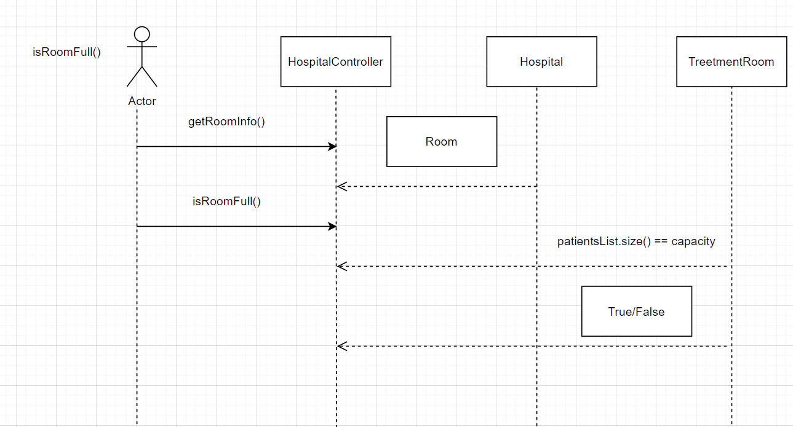
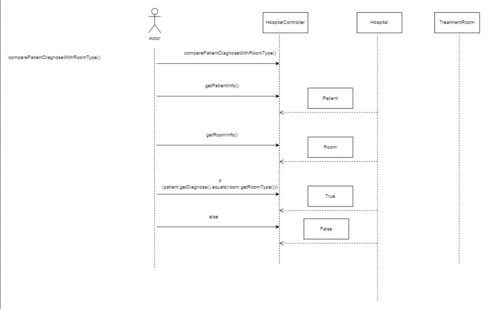
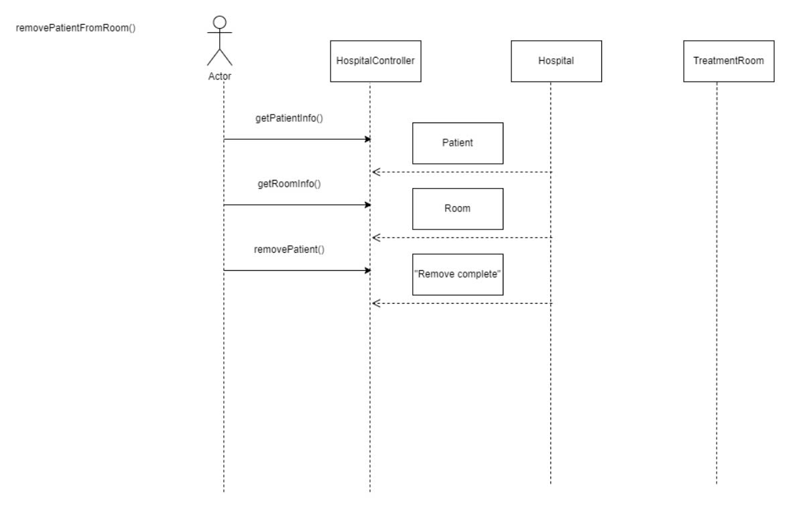
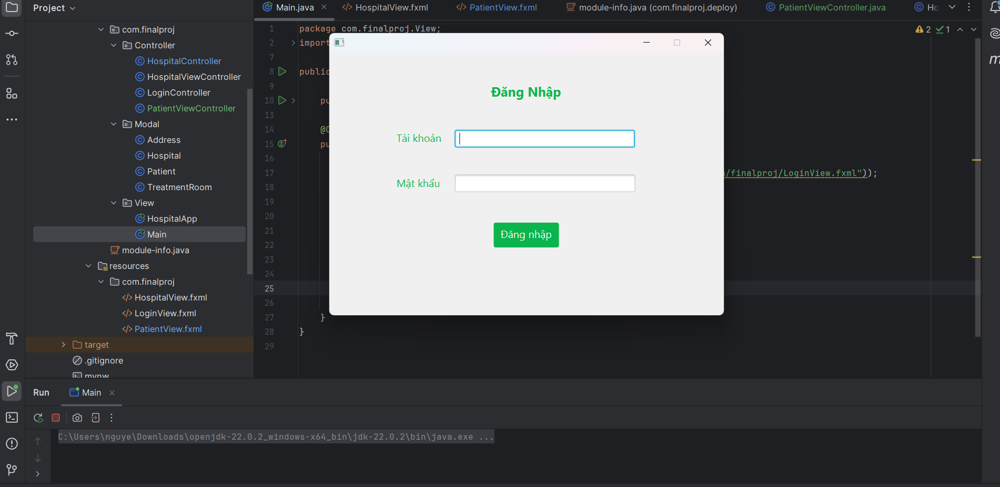

GROUP_10-OOP-N03 
# Hệ Thống Quản Lý Bệnh Viện

## Giới Thiệu Dự Án
Dự án này là một hệ thống quản lý bệnh viện, giúp tối ưu hóa và cải thiện hiệu quả hoạt động của các bệnh viện. Hệ thống cho phép quản lý hồ sơ bệnh nhân.
## Thành Viên Nhóm
- **Hoàng Lê Đức Huy**: Phát triển phần mềm toàn diện.
- **Nguyễn Hà Nguyên**: Phát triển phần mềm toàn diện.

## Chức Năng Chính
- Thêm, sửa, xoá bệnh nhân
- Thêm, sửa, xoá phòng điều trị
- Lấy thông tin bệnh nhân
- Lấy thông tin phòng điều trị
- Thêm bệnh nhân vào phòng điều trị(Nhập viện)
- Xoá bệnh nhân khỏi phòng điều trị(Ra viện)

## UML Dự Án

## 1.1 UML Component Diagram



## 1.2 UML Sequence Diagram

## 1.2.1 : assignPatientToRoom()



## 1.2.2 : isRoomFull()



## 1.2.3 : comparePatientDiagnoseWithRoomType()



## 1.2.4 : removePatientFromRoom()



## Giao diện đầu tiên của dự án


## GitHub Pages Dự Án
[Truy cập dự án tại đây](https://nguyen1976.github.io/JAVA_OOP_PKA_Nhom_10/)


## Cách Cài Đặt
1. Clone repository từ GitHub:
   ```bash
   git clone -b FinaltermCode https://github.com/Nguyen1976/JAVA_OOP_PKA_Nhom_10.git
   
